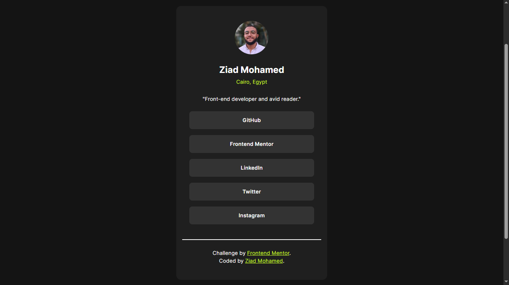

# 🔗 Social Links Profile

  

A responsive social links profile built with HTML and CSS as part of a Frontend Mentor challenge.

## 📖 About the Challenge

This project is a solution to a Frontend Mentor challenge focused on building a responsive profile card with interactive social links.

## ✨ Highlights

- 📱 Responsive layout for different screen sizes.
- 🧱 Semantic HTML structure.
- 🎨 Interactive hover effects.
- 🖼️ Circular profile image with clean card layout.

## 🛠️ Built With

  

## 💡 Key Takeaways

Throughout this project, I practiced:

- Structuring the page using semantic HTML.
- Building a responsive card layout with CSS.
- Using Flexbox for alignment and spacing.
- Applying hover states to improve user interaction.
- Deciding when responsive breakpoints are appropriate.

## 🔗 Links

- 🌐 **Live Site:** *(https://frontend-mentor-social-links-profil.vercel.app/)*
- 💻 **Repository:** *(https://github.com/Ziad-mo205/Frontend-Mentor---Social-Links-Profile.git)*
- 🎯 **Frontend Mentor Solution:** *()*
